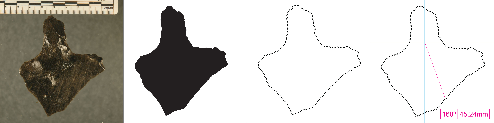

```{r, setup, error=FALSE, message=FALSE,   echo=FALSE, cache=TRUE, warning=FALSE}
#suppressPackageStartupMessages(library(rCharts, quietly=TRUE))
library(knitr)
library(httr)
library(Rmisc)
library(plotrix)
set_config( config( ssl.verifypeer = 0L ) )
opts_chunk$set(fig.align='left') 
library(devtools)
install_github("vbonhomme/Momocs")
library(Momocs)
```


```{r, data-analysis, echo=FALSE, message=FALSE, cache=TRUE, warning=FALSE}
# some constants we use in the file
data.path <- "../Data/RapaNuiMataaData.txt" 
scalingFactor = 75 ## this is the # of pixels per cm. 
xCenter = 12 # x coordinate of centroid (if its fixed, otherwise can be aligned based on average centroid, etc.)
yCenter = 11 # y coordinate of centroid

# We read the whole file
PAST <- read.table(data.path, header = TRUE, sep="\t")
last.meta <- which(colnames(PAST)=="X1") - 1
fac <- PAST[, 1:last.meta]
# xy will contain coordinates only
xy <- as.matrix(PAST[, -c(1:last.meta)])
scaledXY <- xy/scalingFactor
# a short loop to reorder thing and store them in a list
coo <- list()
for (i in 1:nrow(scaledXY)){ 
  coo[[i]] <- cbind(scaledXY[i, seq(1, ncol(scaledXY), 2)], scaledXY[i, seq(2, ncol(scaledXY), 2)])}
# we renames the components of the list (ie the shapes)
names(coo) <- fac[, 1]

# now we create the Out object (formerly Coo,
# but Coo is now a super-class now in order to handle outlines, open outlines, and
# landmarks)
RapaNui <- Out(coo, fac=fac)

## Descriptive information for the paper
numberOfMataa <- nrow(scaledXY)

# Create vectors of the lengths and widths for descr. stats. 
## note that in the images 1 cm = 75 pixels
lengths <- 0
widths <- 0
for (i in 1:nrow(scaledXY)){ 
  lengths[i] <- (max(scaledXY[i, seq(2, ncol(scaledXY), 2)])-min(scaledXY[i, seq(2, ncol(scaledXY), 2)]))
  widths[i] <- (max(scaledXY[i, seq(1, ncol(scaledXY), 2)])-min(scaledXY[i, seq(1, ncol(scaledXY), 2)]))
}

# descriptive values
meanLength <-mean(lengths)
sdLength <-sd(lengths)
meanWidth <- mean(widths)
sdWidth <-sd(widths)

# Determine maximum width and length
xMaxLength<-0
xMaxWidth<-0
for (i in 1:nrow(scaledXY)){ 
  xMaxLength[i]<-(max(scaledXY[i, seq(2, ncol(scaledXY), 2)])-min(scaledXY[i, seq(2, ncol(scaledXY), 2)]) )
  xMaxWidth[i]<-(max(scaledXY[i, seq(1, ncol(scaledXY), 2)])-min(scaledXY[i, seq(1, ncol(scaledXY), 2)]) )
  }

# Create some descriptions of the numbers of mataa in different categories
englertMataa <- length(which(fac[3] == "Englert"))
bishopMataa <- length(which(fac[3]=="Bishop"))
unknownMataa <- length(which(fac[3]=="Unknown"))
numberOfSites <-length(fac[4])-1


# the dmp function
dmp <- function(q, xlab="", ylab="", title="", th0=pi/2,
                cols, palette=col.summer, leg, ...){
  op <- par(mar=c(5.1, 0, 4.1, 0))
  q <- q/max(q)
  nr <- nrow(q)
  nc <- ncol(q)
  #th <- seq(0, 2*pi, length=nc+1)[-(nc+1)] + th0
  th <- seq(0, 2*pi, length=nc) + th0
  xi <- t(apply(q, 1, function(r) r*cos(th)))
  yi <- t(apply(q, 1, function(r) r*sin(th)))
  if (missing(cols)) cols <- palette(nr)
  plot(NA, asp=1, xlim=c(-1, 1), ylim=c(-1, 1),
       xlab=xlab, ylab=ylab, main=title,
       xaxs="i", las=1, ann=FALSE, axes=FALSE, frame=FALSE)#, ...)
  lines(cos(th), sin(th), col="grey80")
  for (i in seq(0, 1, 0.25)){
    lines(i*cos(th), i*sin(th), col="grey80", lty=2)}
  th.grid <- seq(0, 2*pi, length=9)
  segments(0, 0, cos(th.grid), sin(th.grid), col=c("grey80"), lty=2)
  for (i in 1:nr) lines(xi[i, ], yi[i, ], col=cols[i])
  if (missing(leg)) leg <- rownames(q)
  legend("topright", lwd=1, col=cols, legend=leg, cex=3/4, bty="n")}

# just a domestic plotter
ci.plot <- function(x){
  #x$coo <- lapply(coo.trans$coo, x$coo, - 625, - 500)
  x <- lapply(x$coo, function(x) apply(x, 1, ed, pt2=c(-600, -500)))
  #x <-lapply(x$coo,coo.interpolate,360)
  #x <- lapply(x$coo, coo.centdist)
  x <- matrix(unlist(x), nrow=length(x), byrow=TRUE)
  xCI <- apply(x, 2, CI,ci = 0.95)
  ## now add some and substract to differentiate between the 3 lines.. this is just arbitrary spacing.
  l<-xCI[1,]-100
  m<-xCI[2,]
  u<-xCI[3,]+100
  xxCI=rbind(l,m,u)
  dmp(xxCI)}

quartiles.plot<-function(x){
  #x$coo <- lapply(coo.trans$coo, x$coo, - 625, - 500)
  x <- lapply(x$coo, function(x) apply(x, 1, ed, pt2=c(-600, -500)))
  #x <-lapply(x$coo,coo.interpolate,360)
  #x <- lapply(x$coo, coo.centdist)
  x <- matrix(unlist(x), nrow=length(x), byrow=TRUE)
  quartilesCI <- apply(x, 2, quantile, probs=seq(0, 1, 0.25)
  dmp(quartilesCI)
  }

```

# Introduction

Rapa Nui (Easter Island, Chile) is a tiny island located in a remote corner of Eastern Polynesia, more than 2000 km from the nearest inhabited body of land (Figure 1). The island was first colonized by Polynesians who sailed from central East Polynesia in voyaging canoes during the 13th century AD [@Hunt:2006aa; @Wilmshurst:2011aa]. Depsite the island's diminuitive size, remoteness, and limited natural resources, the archaeological record of Rapa Nui is well-known for its nearly 1000 multi-ton statues known as *moai* that once sat atop massive stone platforms known as *ahu* [@Hunt:2011aa]. 


The dramatic prehistoric investment in monumental architecture stand in marked contrast to the Rapa Nui's environment and historically observed population levels. Even at the first point of European contact, the tiny island was largely devoid of trees and population sizes were just about 3000 individuals [@Hunt:2011aa, p. XXX]. While earlier researchers [e.g., @Heyerdahl:1965aa; @Heyerdahl:1989aa] believed the depleted and depauperate state of the island was due to conflict between Polynesians and elite from South America, more recent reseachers have interepreted the contrast between the spectacular nature of the archaeological record and the sparse enviornment of the island as the outcome of a prehistoric environmental catastrophe [@Bahn:1992aa; @Flenley:2003aa].  These researchers argue that based largely on oral traditions, that prehistoric populations grew in numbers until resource use exceeded the carrying capacity and the island underwent catastropic demographic collapse. This account has been popularlized as the "collapse" scenario [@Diamond:1995aa; -@Diamond:2005aa].

New research, however, has challenged this notion with empirical evidence generated from the archaeological record that the Rapanui flourished on the island until AD 1722 when Europeans brought diseases and other social disruptions [@Hunt:2007aa; @Hunt:2007ab; @Hunt:2009aa; @Hunt:2009ac; @Hunt:2011aa; @Hunt:2011ab; @Lipo:2009ab; @Mulrooney:2009aa; @Mulrooney:2012aa; @Rainbird:2002aa]. Investigations on Rapa Nui's settelement patterns demonstrates that the island's inhabitants lived in a dispersed pattern in a low density fashion [@Hunt:2011aa; @Morrison:2012aa]. In addition, studies show that subsistence was largely based on extensive but marginally productive lithic mulch gardens to boost the nutrient-poor soil to a level that sustained sweet potato cultivation [@Bork:2004aa; @Ladefoged:2005aa; @Ladefoged:2010aa; @Ladefoged:2013aa; @Mieth:2010aa; @Stevenson:2002aa; @Stevenson:2006aa]. Finally, demise of the once extensive palm tree forest appears to have had little to do with statue construction or changes in carry capacity [@Hunt:2011aa; @Lipo:2013aa].

One of the claims that persists that is thought to support the "collapse" scenario is the idea that prehistoric Rapa Nui populations experienced intense warfare during late prehistory when resources became increasingly scarce [@Bahn:1992aa; @Diamond:1995aa, @Diamond:2005aa; @Flenley:2003aa]. Oral traditions are known that attribute the toppling of stone statues to intertribal prehistorc warfare [@Bahn:1992aa]. But the existence of fallen statues alone does not necessarily imply warfare since other natural explanations are more likely [@Edwards:1996aa]. Indeed, the existing evidence points to the toppling of statues as as series of post-contact historic events rather than prehistory [@Hunt:2011aa]. Most significantly, examples of defensive structures are entirely lacking in the island's archaeological record [@Hunt:2011aa; @Lipo:2014aa].  Overall, much of the evidence for prehistoric warfare among the inhabitants of Rapa Nui comes from oral traditions recorded in the 20th century [e.g., @Routledge:1919aa]. The oral traditions, however, have an unknown relation to prehistory. Metraux [-@1940:aa, p. XXX], for example, argues that most of the traditions are likely recent and thus likely do not reflect prehistoric events.   

The one example of empirical evidence used to support arguments about prehistoric warfare on Rapa Nui is the presence of *mata’a*, flaked obsidian stemmed tools. *Mata’a* are a class of hafted flaked obsidian artifacts that are found commonly on Rapa Nui. As relatively simple stemmed obsidian tools with wide blades, their form is similar to artifacts known as *mata* found on other Polynesian islands such the basalt artifacts found on New Zealand, Pitcairn and the Chatham Islands [@Balfour:1917aa; @Metraux:1957aa, p. 232; @Skinner:1958aa] as well as New Britain, Papua New Guinea [e.g., @Araho:1997aa; @Specht:1988aa; @Torrence:2009aa; @Torrence:2009ab; @Torrence:2013aa].

In the current analysis, we seek to explore whether there exists variability in the shape of *mata'a* that sheds provides information about the fucntional environment in which these artifacts interacted.  Using a large image database of 'r numberOfMataa' *mata'a* from Rapa Nu, we conduct quantitative morphometric analyses to further investigate whether specific tool classes might be identifiable in the range of shapes in which these artifacts are found. Morphometric analyses enable on to explore shape as a continuous property of objects rather than requiring us treat shape as nominal categories. In this way we can use principal components analyses to see of particular kinds of shapes map to particular locations, environments or source material. In addition, we can examine the relative patterns *mata’a* shape variability and to look for areas of shape that are constrained versus those that were more free to vary. Overall, our results conclude that mata’a were only functionally constrained in terms of the haft and had signficant variation on the distal end and blade.  These results continue to support the alternative hypotheses that these artifacts were not used as weapons. The degree of similarity, however, of the haft portion of *mata'a* and the low degree of constraint in the blade poses an intriguing puzzle: we have yet to identify the role(s) that these objects played in Rapa Nui subsistence and settlement.  

# Approach

On the surface landscape of Rapa Nui, *mata'a* are one of the most numerous shaped artifact classes. *Mata'a* have been noted since the earliest European visitors described the island.  Members of Cook's expedition to the island commented that the islanders “had lances or spears made of thin ill-shaped sticks, and pointed with a sharp triangular piece of black glassy lava” [@Saher:1990aa, p. 35]. *Mata'a* are often assumed to be "spears" largely because of their resemblance to European varieties rather than any direct observation of their use.  Scars noted by early European observers are also believed to have been inflicted by *mata'a* though there is no clear evidence that their use was lethal.  For example, in his voyage to Rapa Nui in 1770, Captain Don Felipe González [@Haedo:1908aa, p. 99] remarked that "they [Rapanui] possess no arms, and although in some we observed sundry wounds on the body, which we thought to have been inflicted by cutting instruments of iron or steel, we found that they proceeded from stones, which are their only [weapons of] defence and offence, and as most of these are sharp edged they produce the injury referred to."

Even if we had direct observations of these objects being used in "spear-like" fashion, the unavoidable tendency for these European observers to interpret what they saw through their own preconceptions requires us examine the physical evidence available on mata'a. In this way we can learn not only the range of interactions that the objects had with the environment but also determine if there is variablity in their use through time or over space. 

Overall, *mata'a* vary greatly in size and shape, but average 6-10 cm in width and length. Technologically, they are formed from unifacial flakes derived trough hard hammer percussion on obsidian cores quarried from one of the island's obsidian sources.  Most of the shaping of the *mata'a* occurs during the creation of a stem that presumably serves as a haft. The stem is formed from one of the lateral margins of the original flake where blade constitutes the remaining distal and opposite lateral margins. *Mata'a* stems and shoulders are formed by unifacial flaking and are generally lenticular in cross section. Overall, the blade shape is dominated by the shape of the parent flake though some shaping through secondary flaking is sometimes evident. Often, large areas of cortex still cover much of one face. 

In exploring the the way in which *mata'a* forms vary, researchers have noted that there is a great diversity of shape and this feature has remained one particularly puzzling aspect of *mata`a* [@Mulloy:1961aa]. *Mata`a* shapes are highly inconsistent and vary from rounded to subangluar to angular to complex.  Early researchers assigned mata`a shape variation to what they conceived as ethnographic categories based on Rapanui words [i.e., @Routledge:1919aa].  Later attempts to construct systematic classifications have also focused on identifying types based on characterizations of overall shape.  None of these classification efforts produced useful categories.

Mulloy [-@Mulloy:1961aa, p. 151], for example, argued that “no significant clustering or correlations could be extracted.... the material represents a continuous range of variation without objective natural order, and that the only classification possible must involve the subjective selection of ideal types from infinite series of possibilities, and the arbitrary reference of intermediate for to one or another of these.”  Mulloy concluded manufacturing procedures dictated shapes and differences in overall shape of mata’a were best explained by chance.
 
The overall shape of an object is rarely a useful dimension for problem-oriented classification [@Dunnell:1986aa]. The forms of objects are limited by technological constraints of the material, performance aspects that depend upon the range of environments in which the object is used, and simple idiosyncratic variability related to the manufacturer and the process of production.  In the case of *mata’a* much of the variability in the overall blade shape can be explained by the contingent results involved in the stages of manufacture [@Bollt:2006aa]. The difference in shapes, therefore, may have structured  functional variation related to the range and kinds of activities for which the tool was primarily used.  Studies of use-wear found on *mata'a* point to the tool being used primarily for scraping and cutting or some combination  [@Church:1994aa; @Church:1996aa]. 

A recent study of *mata'a* shape using stylistic classes and deterministic frequency seriation as a means for examining how class frequencies changed over space and through time showed remarkably continuous change [@Lipo:2010aa]. The seriation results suggest that the source of variability in *mata'a* form is largely being inherited through the social learning of manufacturing techniques between indivdiuals.  The evidence also indicates that variability in the form of *mata'a* is not related to how the *mata'a* performed in its use environment(s).   Overall, our growing understanding of *mata'a* variability continues to support their form being related to ceremonial or cultivation activities and not as weapons invovled in warfare [@Bollt:2006aa; @Lipo:2010aa].

In our analysis here, we focus on *mata'a* variability in the blade portion of the mata'a relative to the stem.  We assume that as hafted objects the point at the center of the stem where it meets the blade can be held constant for comparisons of shape.  We then assume that due to performance the functional aspects of the tool will result in shape variability that is more constrained than the non-functional or stylistic attributes [@Lipo:2012aa]. The constraints are the result of natural selection that serves to sort shape variability in proportion to the benefits/drawbacks to performance. Based on this notion, we hypothesise that:

   - If *mata’a* are weapons, the distal end of the artifact will be constrained. However, if *mata’a* are not weapons, other areas of the tool will show greater constraint  consistent with alternate functions.
   
   - If *mata’a* are weapons, the distal end of the artifact will show a tendency towards a pointed spear-like shape that will penetrate either enemies or prey. If *mata’a* are not weapons, there will be no such constrictive tendency at the distal end of the tool.
   
   - If there was inter-tribal warfare, *mata’a* from distinct areas may show stylistic traits of distinct groups. If natives were not divided into warring groups, distinct stylistic  traits may or may not be apparent. 


Table 1:  *Mata'a* included in analyses by collection.
```{r kable1, results="asis", message=FALSE, echo=FALSE, warning=FALSE}
byCollection <- table(fac$Collection,fac$Site)
bySource <- table(fac$Source,fac$Site)
kable(byCollection, digits=0)
```

Table 2:  *Mata'a* included in analyses by location.
```{r kable2, results="asis", message=FALSE, echo=FALSE, warning=FALSE}
kable(bySource,digits=0)
```

# Methods and Data

In order to test these hypotheses, we used morphometric outline analysis.  Morphometrics is the quantitative analysis of form [@Bookstein:1982aa; @Bookstein:1985aa]. It has advantages over traditional studies of shape that treat shape as a nominal character (e.g., "triangular", "square", "round"). Even classifications that break shape into a series of dimensionally constructed classes must reduce variability into modal categories. Morphometrics avoids this problem by analyzing shape as a series of measurements that comprise outline or landmarks. One major feature of morphometrics is its ability statistically test hypotheses about the factors that affect shape. With this technique exact outlines of artifacts can be overlaid and compared making variations between artifacts readily apparent.

Measurements for morphometrics can be generated in a number of ways.  The earliest form of morphometrics focused on identifying the location specific landmarks. This approach requires defining features of interest that are to be examined as to how they relate to each other.  In the case of artifacts such as *mata'a* there are few consistent landmarks to hold constant other than perhaps the distal and proximal end. In these such cases, one can conduct an analysis of what is known as "semi-landmarks," a standard number of regularly positioned points around the outline of an object [@Bookstein:1997aa; @Gunz:2013aa].

@Thompson:1917aa
  
In our morphometric analyses we make use of Momocs, an R package developed by Bonhomme [-@Bonhomme:2013aa]. Momocs builds upon techniques developed by Claude [-@Claude:2008aa]. 

For our analyses of Rapa Nui *mata'a*, our assemblage consisted of planview photographs of (N='r numberOfMataa') artifacts from two museum collections. The first museum collection consisted of `r englertMataa`  *mata'a* housed at the P. Sebastian Englert Museum on Rapa Nui.  This collection is composed of photograps of *mata'a* collected from `r numberOfSites` locations on the island as well as `r unknownMataa ` *mata'a* for which provience is known only to the level of the island itself (Figure 2). 

The second collection of *mata'a* is composed of `r bishopMataa` objects housed at the Bishop Museum, Honolulu, Hawai'i. These *mata'a* consist of examples  purchased from the island by a private collector in 1920, collections made by Kenneth P. Emory in 1929-1931 and various gifts to the museum [@Mulrooney:2014aa, p. 5-6]. Mulrooney and colleagus took photos of these *mata'a* during their study of obsidian sourcing via pXRF [@Mulrooney:2014aa]. While we can only attribute the source of these *mata'a* to Rapa Nui and and not a specific location, Mulrooney and colleagues kindly provided source identifications for each mata'a based on the results of their study. In this way, we can also examine shape variability as a product of the obsidian source.


# Data

For our analyses, we used scaled photos of mata'a and aligned them with midpoint where the stem meets the blade. Using TPSdig software [@Rohlf:2014aa], we created outlines of each mata’a using 200 sets of X-Y coordinates measured along the perimeter of the artifact (Figure 3).  


 
```{r length_metrics, message=FALSE, echo=FALSE, warning=FALSE, fig.width=2,fig.height=2}
par(mfrow=c(1, 2))
hist(lengths, main="Mata'a Length") 
```
Figure 4: *Mata'a* lengths.
x
```{r width_metrics, message=FALSE, echo=FALSE, warning=FALSE, fig.width=2,fig.height=2}
hist(widths, main="Mata'a Width") 
par(mfrow=c(1, 1))
```
Figure 5. *Mata'a* widths.

```{r width_metrics, message=FALSE, echo=FALSE, warning=FALSE, fig.width=4.5,fig.height=4.5}
# we interpolate before equianular sampling
RapaNui$coo <- lapply(RapaNui$coo, coo.interpolate, 360)
RapaNuirr.int <- coo.samplerr(RapaNui, 360) # and plot this one
par(mfrow=c(1,1))
ci.plot(RapaNuirr.int)
quartiles.plot(RapaNurr.int)
par(mfrow=c(1, 2))
```
Figure 6.  Variability in *mata’a* shape shown with 95% confidence intervals and quartiles.

```{r family_picture, message=FALSE, echo=FALSE, warning=FALSE, fig.width=3,fig.height=3}
# A family picture
panel(RapaNui, fac = "Collection")
panel(RapaNui, fac = "Site")
panel(RapaNui, fac = "Island")
panel(RapaNui, fac="Source", reorder="Source")

# Lets begin by centering, scaling them 
stack(RapaNui)

```
Figure 7. *Mata'a* shape variability. After aligning the *mata'a* with respect to the center of the stem at the point in which it intersects the blad, we show the outlines of each of the *mata'a* superimposed.    


```{r polar_plot, message=FALSE, echo=FALSE, warning=FALSE, fig.width=4.5,fig.height=4.5}
polar.plot(upperCI,angles,pos=NULL,label.pos=NULL, start=0,clockwise=TRUE,rp.type="l",lty=3, line.col=3) 
par(new=T)
polar.plot(mean,angles,pos=NULL,label.pos=NULL, start=0,clockwise=TRUE,rp.type="l",line.col=4) 
par(new=T)
polar.plot(lowerCI,angles,pos=NULL,label.pos=NULL, start=0,clockwise=TRUE,rp.type="l",lty=3, line.col=5) 
par(new=F)
```
Figure 8. *Mata'a* statistical estimation of shape variability: mean and 95% confidence intervals.

#Morphometric Analyses

Procrustes superimposition uses the the centroid of the shapes to (0,0) as the bases for comparison between shapes.  The centroid is calculated on the based of average of the x and y coordinates.   The shapes are then scaled so that they are equivalent by multipling the coordinates of each semilandmark by the suare root of the summed squared distances between the centroid and each semilandmark. The algorithm then rotates each shape until there is minimal distance between the shape and the mean shape for all shapes.  For the semilandmarks, the variation in position of each semilandmark along the outline curve is also removed. Analyses are done by projecting shapes onto a space tangent to shape space. Within the tangent space, conventional multivariate statistical methods such as multivariate analysis of variance and multivariate regression, can be used to test statistical hypotheses about shape.

```{r, pca-prep, echo=FALSE, cache=TRUE, warning=FALSE, message=FALSE}
RapaF <- eFourier(RapaNui, 12)
RapaP <- fgProcrustes(RapaNui)
RapaFP <- eFourier(RapaP, 12, norm=FALSE)

```

## By Source
```{r, rapaf-plot,fig.width=4.5,fig.height=4.5}

plot(PCA(RapaF), "Source")

```


```{r, rapafp-plot,results='asis', fig.width=4.5,fig.height=4.5}
plot(PCA(RapaFP), "Source") # Procrustes aligned (normalization of the outlines)
```

## By Site
```{r, rapafs-plot, results='asis', fig.width=4.5,fig.height=4.5}
plot(PCA(RapaF), "Site") # regular EFT with normalized coefficients
```

```{r, rapafps-plot, results='asis', fig.width=4.5,fig.height=4.5}
plot(PCA(RapaFP), "Site") # Procrustes aligned (normalization of the outlines)
```


#Some embedded plots.

```{r, rapafp-p, results='asis', fig.width=4.5,fig.height=4.5}
plot(PCA(RapaFP), "Site") # Procrustes aligned (normalization of the outlines)
```

# References Cited

